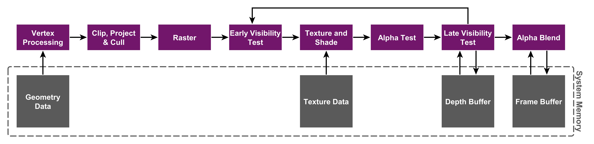

<!-- .slide: data-background="images/bg-1.png" -->

## Building Mobile Web Apps  

 

### ArcGIS API for JavaScript

 

Andy Gup, ESRI Redlands

Lloyd Heberlie, ESRI Redlands

Thomas Other, ESRI R&amp;D Center Z&uuml;rich

---

<!-- .slide: data-background="images/bg-4.png" -->

### Topics

- GPU Hardware
- GPU Architecture
- 3D on Mobile Devices
- Performance
- JavaScript API Example
- Progressive Web Apps

---

<!-- .slide: data-background="images/bg-4.png" -->

### GPU Hardware

  

    <h4> Apple A10</h4>
    

    <small>
      <ul>
        <li>TBDR Architecture  </li>
        <li>650 MHz Clock</li>
        <li>12 Clusters</li>
      </ul>
        
      <h5>> <b>500</b> GFLOPS</h5>
    </small>
     
    
  

  

    <h4> Intel Kaby Lake</h4>
    

    <small>
      <ul>
        <li>TB/EZ IMR Architecture  </li>
        <li>1115 MHz Clock</li>
        <li>48 Clusters</li>
      </ul>
        
      <h5>> <b>730</b> GFLOPS</h5>
    </small>
     
    
  

  

    <h4> nVidia Pascal</h4>
    

    <small>
      <ul>
        <li>TB/EZ IMR Architecture  </li>
        <li>1465 MHz Clock</li>
        <li>256 Clusters</li>
      </ul>
        
      <h5>> <b>750</b> GFLOPS</h5>
    </small>
     
    
  

Source http://kyokojap.myweb.hinet.net/gpu_gflops/

---

<!-- .slide: data-background="images/bg-4.png" -->

### GPU Architecture
#### IMR vs. TBDR

  

    
 Immediate Mode Renderer

    

  

  

    
 Tile Based Delayed Renderer

    

  

   
  Source https://www.imgtec.com/blog/a-look-at-the-powervr-graphics-architecture-tile-based-rendering/

---

<!-- .slide: data-background="images/bg-4.png" -->

### GPU Architecture
#### Simple Rendering

  
    
  <table style="width: 60%; font-size: 0.6em">
    <tr>
      <td></td>
      <td>Immediate Mode Renderer</td>
      <td>Tile Based Delayed Renderer</td>
    </tr>
    <tr>
      <td>Texture Reads</td>
      <td>150 \* 4 Bytes</td>
      <td>150 \* 4 Bytes</td>
    </tr>
    <tr>
      <td>Depth Reads</td>
      <td>200 \* 4 bytes</td>
      <td>0 bytes</td>
    </tr>
    <tr>
      <td>Depth Writes</td>
      <td>150 \* 4 bytes</td>
      <td>0 bytes</td>
    </tr>
    <tr>
      <td>Color Writes</td>
      <td>150 \* 4 bytes</td>
      <td>0 bytes</td>
    </tr>
    <tr>
      <td>Total Bandwidth</td>
      <td><b>2600</b> bytes</td>
      <td><b>600</b> bytes</td>
    </tr>
  </table>
    
    
  Source https://www.anandtech.com/show/4686/samsung-galaxy-s-2-international-review-the-best-redefined/15

---

<!-- .slide: data-background="images/bg-5.png" -->

### ArcGIS JavaScript API
#### 3D on Mobile Devices

- Works on mobile
  - Apple iPhone 8
  - Apple iPad Pro 2
  - Samsung Galaxy S8
  - Samsung Galaxy Tab S3
- It's as simple as opening a webpage
  - http://www.arcgis.com/home/webscene/viewer.html

---

<!-- .slide: data-background="images/bg-5.png" -->

### ArcGIS JavaScript API
#### Performance

 - Performance can vary across
   - Hardware
   - Operating System
   - Browser Vendor
 
 - Poor performance can be avoided by
   - keeping the number of layers limited (10 - 30)
   - using appropriate symbols for every visualization
   - using advantageous viewpoints
   - throttling resource consumption
   - turning off features

---

<!-- .slide: data-background="images/bg-5.png" -->

### JavaScript Example
#### Change Quality and Visualizations

  

    <pre style="margin-left: 100px"><code class="lang-js hljs javascript">
require([
  "esri/Map",
  "esri/layers/FeatureLayer",
  "esri/layers/SceneLayer",
  "esri/views/SceneView"
], function(
  Map,
  FeatureLayer,
  SceneLayer,
  SceneView
) {
  var view = new SceneView({
    map: new Map({
      basemap: "satellite",
      ground: "world-elevation",
      layers: [
        new FeatureLayer({ url: "//services.arcgis.com/..." }),
        new SceneLayer({ url: "//services.arcgis.com/..." })
      ]
    }),
    container: "viewDiv"
  });
});
    </code></pre>
     
    <small>
      <table>
        <tr>
          <td></td>
          <td style="padding: 10px">featureLayer.renderer.symbol</td>
        </tr>
        <tr>
          <td></td>
          <td style="padding: 10px">view.environment.lighting.directShadowsEnabled</td>
        </tr>
        <tr>
          <td></td>
          <td style="padding: 10px">view.qualityProfile view.environment.atmosphere.quality</td>
        </tr>
      </table>
    </small>
  

  

    <iframe id="frame-performance-view" data-src="./snippets/setup-performance-view.html"></iframe>
  

---

<!-- .slide: data-background="images/bg-5.png" -->

### Progessive Web Apps
#### Service Workers #1

<pre><code class="lang-js hljs javascript">
// index.html

if ('serviceWorker' in navigator) {

  navigator.serviceWorker.register('./service-worker.js', { scope: './' })
    .then(function() {

      if (navigator.serviceWorker.controller) {

        // Service Worker is active

      }
      else {

        // Service Worker is installed but inactive

      }

    })
    .catch(function(error) {

      // An error occurred during Service Worker creation

    });

}
else {

  // The current browser doesn't support service workers

}

</code></pre>

---

<!-- .slide: data-background="images/bg-5.png" -->

### Progessive Web Apps
#### Service Workers #2

<pre><code class="lang-js hljs javascript">
// service-worker.js

// Called during app installation
self.addEventListener("install", function(event) {

  event.waitUntil(
    caches.open("cache_v1")
      .then(cache => {

        return cache.add("./index.html"); // Add index to cache

      });
  );

});

// Called during app start
self.addEventListener("activate", function(event) {});

// Called on every network request when installed and active
self.addEventListener("fetch", function(event) {

  event.respondWith(
    caches.open("cache_v1").then(function(cache) {
      return cache.match(event.request).then(function(response) {

        if (response) {
          return response; // Serving response from cache
        }

        return fetch(event.request.clone()).then(function(response) {
          return response; // Serving response from network
        });

      });
    })
  );

});

</code></pre>

---

<!-- .slide: data-background="images/bg-5.png" -->

### Progessive Web Apps
#### Web App Manifest

<pre><code class="lang-js hljs javascript">
// index.html

<link rel='manifest' href='./manifest.json'>

// manifest.json

{
  "short_name": "Hiking trails",
  "name": "Hiking trails Swiss National Park",

  "icons": [{
    "src": "src/img/android-icon-36x36.png",
    "sizes": "36x36",
    "type": "image/png"
  }],

  "start_url": "index.html",
  "display": "standalone",

  "background_color": "#2d2b07",
  "theme_color": "#b5e2c1"
}

</code></pre>

---

<!-- .slide: data-background="images/bg-final.jpg" -->

