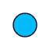
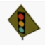
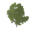
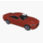
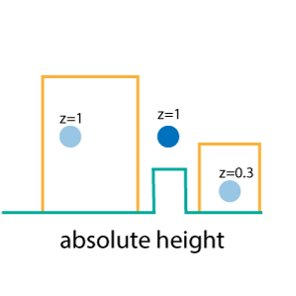
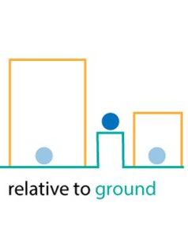
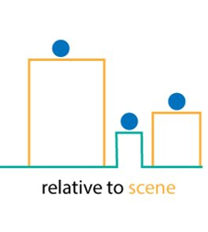

<!-- .slide: data-background="images/bg-1.png" -->

### Building Progressive Web Apps

#### ArcGIS API for JavaScript

<small>
  <p>Andy Gup, @agup, ESRI Redlands</p>
  <p>Rene Rubalcava, @odoenet​, ESRI Redlands</p>
  <p>Thomas Other, ESRI R&amp;D Center Z&uuml;rich</p>
</small>

<br/><br/><br/>

---

<!-- .slide: data-background="images/bg-4.png" -->

## Topics

- Progressive Web Apps
 - Requirements
 - Tips
 - PWA w/ JSAPI
- Mobile Web
 - Improving Performance​
 - Best practices in 3D​

---

<!-- .slide: data-background="images/bg-2.png" -->

## Best practices in 3D​

- SceneLayers
- TiledLayers
- Symbology
- Elevation Alignment
- Quality Profile
- Environment
- Performance Info
- Demo

---

<!-- .slide: data-background="images/bg-2.png" -->

## Scene Layers

Tip: Publish SceneLayers with ArcGIS Pro 2.3 – oriented bounding boxes instead of spherical extents


```js
const sceneLayer = new SceneLayer({
  url: "https://tilesqa.arcgis.com/.../SceneServer"
});

const view = new SceneView({
  container: "viewDiv",
  map: {
    basemap: "topo",

    ground: "world-elevation",

    layers: [ sceneLayer ]
  }
});


function play() {
  ...visualize i3s nodes...
}
```
<div id="i3s-nodevis" play="./snippets/i3s-nodevis.html"></div>

---

<!-- .slide: data-background="images/bg-2.png" -->

## Tiled Layers

Tip: Do you really need to see the sky?​

```js
const view = new SceneView({
  container: "viewDiv",
  map: {
    basemap: "topo"
  }
});


view.watch("camera", (camera) => {
  logMessage(`camera.tilt: ${Math.floor(camera.tilt)}`);
});


function play () {
  view.constraints.tilt.max = 20;

  ...visualize tile borders...
}

```
<div id="tile-bordervis" play="./snippets/tile-bordervis.html"></div>

---

<!-- .slide: data-background="images/bg-2.png" -->

## Symbol Complexity

Tip: Reduce symbol complexity (How many vertices?)

| Icons                                                 | Primitives                                                | Models |
|:-:                                                    |:-:                                                        |:-:|
|       |       |  |
|   |   |  |
|       |           |  |
| <10                                                   | ~100                                                      | >1'000 |
|<td colspan=4>complexity &#x27f6;</td>

<div id="symbol-complexity" play="./snippets/symbol-complexity.html"></div>


---

<!-- .slide: data-background="images/bg-2.png" -->

## Elevation Alignement

Tip: absolute-height is faster than relative-to-ground​

| | | |
|:-:|:-:|:-:|
|  |  |  |
| absolute-height | relative-to-ground | relative-to-scene |

---

<!-- .slide: data-background="images/bg-2.png" -->

## Quality Profile

Tip: A low quality profile reduces memory consumption

Affects: _Map resolution, SceneLayer detail, Anti-aliasing_

```js
const profiles = ["low", "medium", "high"];

let profileIdx = 0;


const view = new SceneView({
  container: "viewDiv",

  map: {
    basemap: "satellite",

    ground: "world-elevation",

    layers: [new SceneLayer({
      url: "https://tilesqa.arcgis.com/.../SceneServer"
    })]
  },

  qualityProfile: "low"
});


function play() {
  profileIdx = (profileIdx + 1) % profiles.length;
  view.qualityProfile = profiles[profileIdx];
}
```
<div id="quality-profile" play="./snippets/quality-profile.html"></div>


---

<!-- .slide: data-background="images/bg-2.png" -->

## Environment Settings

Tip: Shadows and Ambient-Occlusion are expensive​

```js
const profiles = ["low", "high"];
let profileIdx = 0;

const view = new SceneView({
  container: "viewDiv",

  map: {
    basemap: "satellite",
    ground: "world-elevation",
    layers: [new SceneLayer({
      url: "https://tilesqa.arcgis.com/.../SceneServer"
    })]
  }
});

function play() {
  profileIdx = (profileIdx + 1) % profiles.length;

  const highQuality = profiles[profileIdx] === "high";
  const atmosphere = view.environment.atmosphere;
  const lighting = view.environment.lighting;

  lighting.directShadowsEnabled = highQuality;
  lighting.ambientOcclusion = highQuality;
  atmosphere.quality = profiles[profileIdx];
}
```
<div id="environment-profile" play="./snippets/environment-profile.html"></div>

---


<!-- .slide: data-background="images/bg-2.png" -->

## Performance Info

SceneView exposes memory and load/quality information

```js
SceneView.performanceInfo = {
  // The total memory available in bytes.
  totalMemory: number;

  // The memory that is in use in bytes.
  usedMemory: number;

  // Quality level as a percentage.
  quality: number;

  // Average number of frame tasks waiting.
  load: number;

  // The memory currently in use by elevation layers and tiled layers, in bytes.
  terrainMemory: number;

  // The memory currently in use by adding edges to 3D objects in scene layers or extruded polygons, in bytes.
  edgesMemory: number;

  // An array containing information about non-tiled layers.
  layerPerformanceInfos: { layer: Layer; memory: number; ... }[];
}
```

---

<!-- .slide: data-background="images/bg-3.png" -->

## Demo Time

[https://thother.github.io/devsummit-california-2020/demos/resource-info/](https://thother.github.io/devsummit-california-2020/demos/resource-info/)

---

<!-- .slide: data-background="images/bg-4.png" -->


